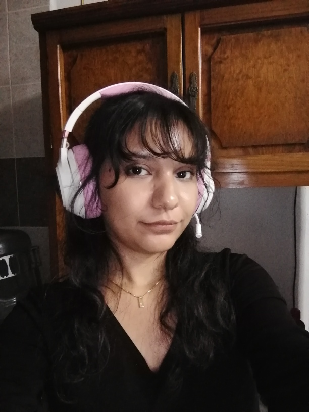

# Presentación

## Tus intereses y experiencias previas relacionadas con videojuegos o desarrollo
Con juegos más que nada ha sido como jugador. Prefiero sobre todo los que tienen colores llamativos y una apariencia bonita y colorida. En cuanto a desarrollo, específicamente en videojuegos no tengo experiencia previa; la mayoría de mis proyectos escolares han sido de otras áreas, más inclinado hacia lo web.

## ¿Qué significa para ti “diseñar un videojuego” en este momento?
Pensar en un juego que pueda ser agradable para el usuario, ya que un juego sin jugadores es como si no existiera. Tomar en cuenta su experiencia, tratar de no limitar el alcance que pueda tener y analizar por qué alguna parte del juego puede ser o no agradable, sin dejarlo solo en un sí o un no.

## Cómo te imaginas tu rol como diseñador durante el curso
Pensar en qué clase de juegos pueden ser entretenidos, pero que no se queden solo en que son bonitos, sino que puedan enganchar a los usuarios y sean principalmente de disfrute. Todo esto teniendo en cuenta las sensaciones que crearían en diferentes tipos de personas para perfeccionar la experiencia.

## Foto

