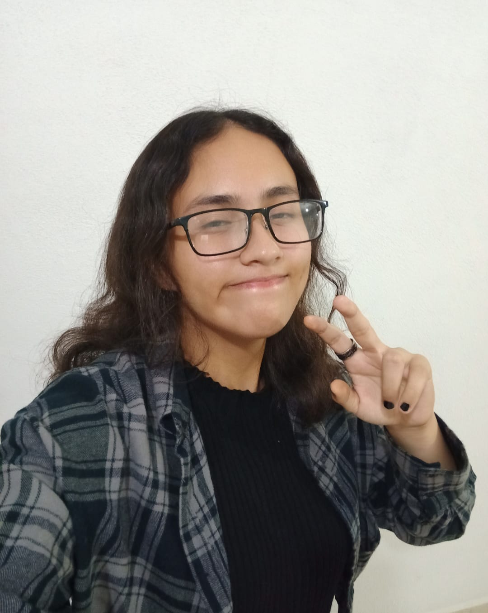

**Tus intereses y experiencias previas relacionadas con videojuegos o desarrollo.**
Siempre me han gustado los juegos desde una temprana edad, antes de tener un celular me gustaba jugar a ser, por ejemplo, un viejo mago profetizado a salvar el mundo o un espía secreto cuya misión era combatir a los villanos, cuando descubrí que sí que podías "vivir" estas experiencias mediante un videojuego me voló la cabeza, que exista la tecnología para que de alguna forma estos simples juegos se conviertan en una "realidad" es algo realmente increíble. Actualmente me gusta mucho jugar con mis amistades juegos como Identity V, Clash of Clans y League of Legends.

**¿Qué significa para ti “diseñar un videojuego” en este momento?**
Diseñar una experiencia, darle la oportunidad a otras personas de que se teletransporten a una realidad ficticia y experimentar el mismo mundo que antes solo estaba en tus pensamientos

**Cómo te imaginas tu rol como diseñador durante el curso.**
Mi segundo mayor hobby después del gaming es el arte (dibujar y pintar, digital o tradicionalmente), por lo tanto supongo que apoyaré en la parte más visual

**Incluye una foto de tu rostro (uso académico interno).**

