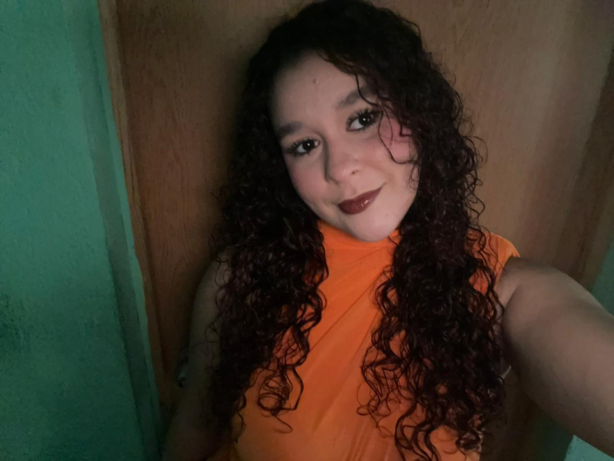

**Reflexión Personal**

**Tus intereses y experiencias previas relacionadas con videojuegos o desarrollo.**

Desde hace ya varios años me han interesado mucho los videojuegos, tanto como forma de entretenimiento como por lo que hay detrás de ellos. He jugado distintos tipos de juegos y eso me despertó curiosidad por cómo se crean: las mecánicas, los niveles, las historias y la programación que hace que todo funcione.
En cuanto al desarrollo, mi experiencia en videojuegos todavía es básica, pero tengo interés en aprender más sobre su desarrollo. Esta materia es de mucho interés para mí, ya que, representa una oportunidad para empezar a convertir ese interés en algo más práctico y concreto.

**¿Qué significa para ti “diseñar un videojuego” en este momento?**

Significa aprender a transformar una idea en algo jugable, significa experimentar, equivocarme y mejorar, entendiendo que el proceso es tan importante como el resultado final.

**¿Cómo te imaginas tu rol como diseñador durante el curso.**

Quiero participar en el proceso creativo, proponer ideas y al mismo tiempo aprender a llevarlas a la práctica usando herramientas y conceptos que veamos en clase. 

**Foto de mí**

